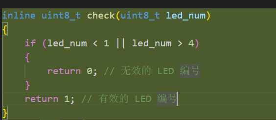
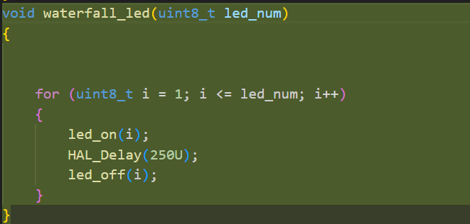
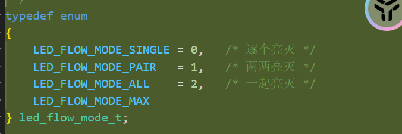
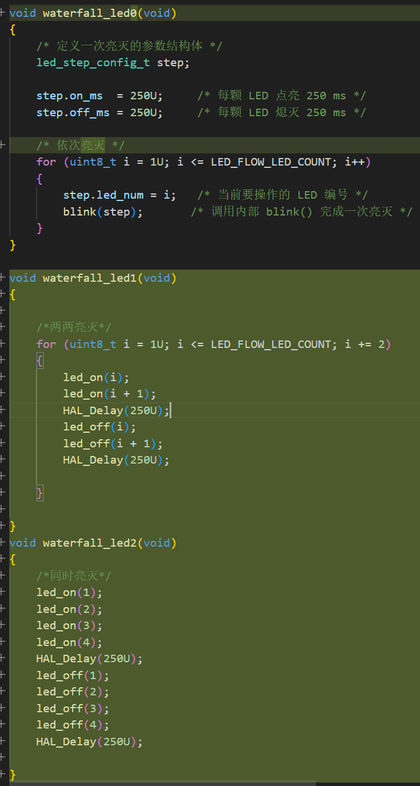

# 9.9学习笔记   任鹏珲

## 1.拓展LED函数

用inline定义函数check做编号越界检查



## 2.实现流水灯

在`led.c`中定义流水灯`waterfall_led`



## 3.封装流水灯

在`led_.h`中用结构体定义一次亮灭的参数，其中`typedef`用来给给这个结构体命名

```c_cpp
typedef struct
{
    uint8_t  led_num;   /* LED 编号，范围 1~LED_FLOW_LED_COUNT */
    uint16_t on_ms;     /* 点亮持续时间，单位 ms */
    uint16_t off_ms;    /* 熄灭持续时间，单位 ms */
} led_step_config_t;
```

用`blink（）`控制单个led，其中`static`使`blink`仅限当前.c使用，将 blink 视为当前模块（LED驱动文件）的私有辅助函数，对外部完全隐藏

`static `只拦“外部文件”（比如 m`ain.c` 直接调` blink()` 会被拦）。

`static `绝不拦“内部调用”（同一个 .c 文件里的 `waterfall_led` 调 blink()，畅通无阻）。

```c_cpp
static void blink(const led_step_config_t step)
{
    led_on(step.led_num);          /* 点亮指定 LED */
    HAL_Delay(step.on_ms);         /* 保持点亮指定时长 */
    led_off(step.led_num);         /* 熄灭指定 LED */
    HAL_Delay(step.off_ms);        /* 保持熄灭指定时长 */
}
```

## 遥控流水灯状态机

用`enum`定义流水灯状态，0表示依次亮灭，1表示两两亮灭，2表示四个同时亮灭



三种状态对应三个函数，最后用switch来实现遥控


## 5.非阻塞调度（借助AI）

这个非阻塞和阻塞，我花了好长时间才理解，怎么实现也是无从下手，然后就借助AI了，然后AI写的我也是看了半天，因为学C语言也没多久，代码读的也少，然后就好好看了一下这个AI的思路，最后终于理解了

这个是主要的函数：

```c_cpp
void led_flow_update(void)
{
    /* 信号变化，立刻切换：不需要等当前步骤播完 */
    if (signal != s_current_mode)
    {
        s_current_mode = signal;
        led_flow_reset();
    }

    /* 时间未到，保持当前输出不变，直接返回 */
    if (!timer_is_expired(&s_step_timer))
    {
        return;
    }

    /* 时间到了，根据当前模式执行下一步 */
    switch (s_current_mode)
    {
        case LED_FLOW_MODE_IDLE:
            all_leds_off();     /* 0：四颗 LED 全灭 */
            /* IDLE 不需要启动定时器，每轮进来都保持全灭 */
            break;

        case LED_FLOW_MODE_SINGLE:
            update_mode_single();
            break;

        case LED_FLOW_MODE_PAIR:
            update_mode_pair();
            break;

        case LED_FLOW_MODE_ALL:
            update_mode_all();
            break;

        default:
            led_flow_reset();
            break;
    }
}
```

其中非阻塞的实现主要靠以下两个函数：
之前阻塞的情况下是应为灯亮和暗都有个持续时间`DELAY_TIME`，相当于一直在等，就算`signal`改变后也不能立马实现模式的切换，这里是吧`DALAY_TIME`给换掉了，用`timer_start`和`timer_is_expired`共同实现，并实现非阻塞，<u>比如`led_on(1)`之后，使用一个`timer_start(&_steo_timer,250U)`,开从0到250的计时，然后用`timer_is_expired`来判断是否到了250，不到的话一直循环，一直判断，到了250，立马进行下一步</u>

```c_cpp
typedef struct
{
    uint32_t start_ms;   /* 启动时刻，由 HAL_GetTick() 获取 */
    uint32_t period_ms;  /* 定时时长，单位 ms */
    uint8_t  running;    /* 运行标志：1 表示正在计时，0 表示已到期或停止 */
} soft_timer_t;

void timer_start(soft_timer_t *timer, uint32_t period_ms)
{
    timer->start_ms = HAL_GetTick();
    timer->period_ms = period_ms;
    timer->running = 1U;
}
```

```c_cpp
uint8_t timer_is_expired(soft_timer_t *timer)
{
    if (!timer->running)
    {
        return 0U;
    }

    if ((HAL_GetTick() - timer->start_ms) >= timer->period_ms)
    {
        timer->running = 0U;    /* 单次触发：到期自动停止 */
        return 1U;
    }

    return 0U;
}
```
